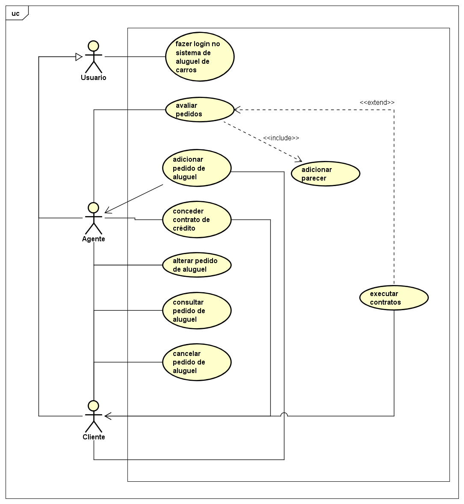
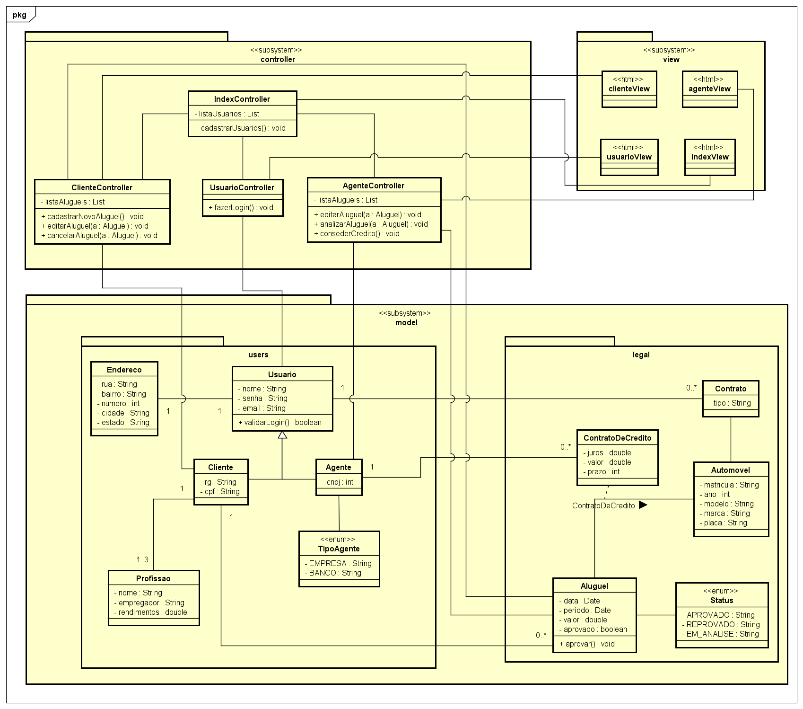
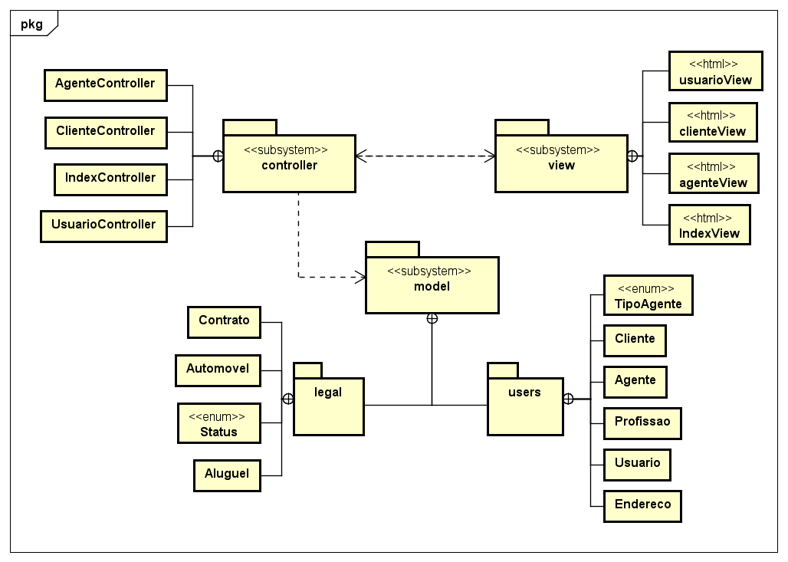
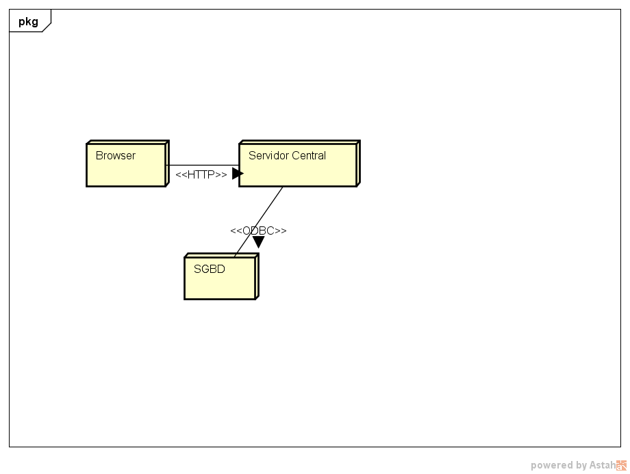

# Histórias de Usuario

US-01: Como usuário eu quero abrir novos pedidos de aluguel para conseguir alugar um carro;

US-02: Como usuário eu quero alterar pedidos de aluguel para atualizar os dados de cada pedido;

US-03: Como usuário eu quero consultar pedidos de aluguel para ver quais são meus pedidos feitos;

US-04: Como usuário eu quero cancelar pedidos de aluguel para desistir de alugar um carro;

US-05: Como agente da empresa eu quero alterar pedidos de aluguel de veículos;

US-06: Como agente da empresa eu quero avaliar pedidos de aluguel de veículos para adicionar meu parecer;

US-07: Como agente financeiro eu quero conceder contratos de credito para usuarios poderem alugar veículos;

# Diagrama de caso de uso

# Diagrama de classes

# Diagrama de pacotes

# Diagrama de componentes

# Diagrama de implantação

